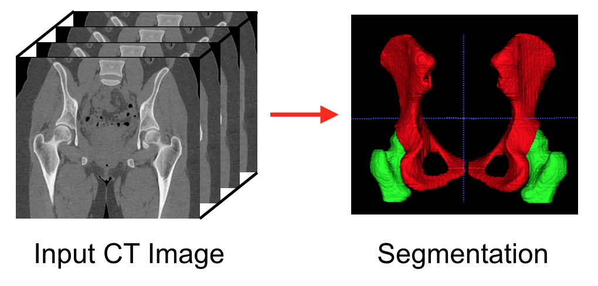
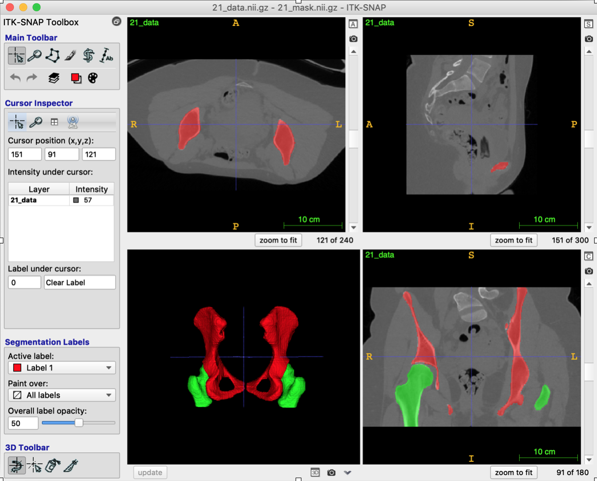

Artificial Intelligence
=======================

.. role:: bash(code)
   :language: bash

In this assignment you will run a deep learning-based algorithm on a GPU to segment the proximal femur and the acetabulum from hip joint CT images.

GPU by UBELIX
-------------

`UBELIX <https://ubelix.unibe.ch>`_ is an acronym and stands for University of Bern Linux Cluster, which is aimed for High Performance Computing (HPC). UBELIX is available to anybody with a valid Campus Account (CA) of the University of Bern. Before you can use this service, you must request the activation of your Campus Account on UBELIX.

Follow the instructions on the `HPC documentation webpage <https://hpc-unibe-ch.github.io/getting-Started/account.html>`_ to request activation of your account:

- mention that you will use deep learning for medical image analysis within the course "Computer Assisted Surgery" of the Master in Biomedical Engineering
- mention that you need access to a GPU

Accessing the HPCs
------------------
(note: to access ubelix you need to be in the unibe-net - use fortclient-VPN:
https://serviceportal.unibe.ch/sp?id=kb_category&kb_id=13b050c9db63c49078ed3e48229619b0&kb_category=240b43f9db8cd05078ed3e4822961979

- Once your account has been activated on UBELIX, you can log in to an HPC

	- On Windows, the SSH client is now installed by default in the current versions of Windows 10 and 11. If for some reason the ``ssh`` command do not work, open Windows Settings and navigate to ``Apps > Optional features`` and very that ``OpenSSH Client`` is shown in the list. If it is not installed, you may be able to do so by clicking ``Add a feature``.

- Run the following commands in a terminal (in PowerShell if on Windows):

	.. code-block:: bash

		ssh <username>@submit01.unibe.ch

- At the password prompt, enter your Campus Account password
- After logging in successfully, you should see the welcome message similar to the following

	.. code-block:: bash

		CentOS 7.9.2009.x86_64

		FQDN:      submit01.ubelix.unibe.ch (10.1.129.22)
		Processor: 20x Intel(R) Xeon(R) Silver 4114 CPU @ 2.20GHz
		Kernel:    3.10.0-1160.45.1.el7.x86_64
		Memory:    92.95 GiB

		[<username>@submit01 ~]$

- see the `official documentation <https://hpc-unibe-ch.github.io/getting-Started/login-ssh.html>`_ if needed

File Transfer to/from UBELIX
----------------------------

You will need to transfer files between your local computer and the HPC. To do so, you can use the ``scp`` command on your local machine:

.. code-block:: bash

    scp /path/to/file <username>@submit01.unibe.ch:/path/to/target_dir/

To copy a file from the HPC to your local computer, also use the ``scp`` command on your local machine:

.. code-block:: bash

	scp <username>@submit01.unibe.ch:/path/to/file /path/to/target_dir/
    
More information about file transfer can be found in the `official documentation <https://hpc-unibe-ch.github.io/file-system/file-transfer.html>`__.

File editor on Ubelix
----------------------------

You will need to edit files on the HPC. To do so, you could use the VIM-editor which is introduced here:

To open an existing file type this:

.. code-block:: bash

    vi filename

example: if you are in the folder ``hip_ct_unet_CAS_code/`` and you would like to open the file job_run_gpu.sh, type: ``vi jo`` then pres tab - the name of the file should be completed automatically. (if it's not the file doesn't exists at this location - to check type "ls")

- editing: as soon the file content is displayed in the console (the VIM editor is open) type "i", this will bring you to "INSERT"-mode (noted on the bottom of the console) - in this mode you can modify the file. press "esc" to exit the INSERT mode (and stop editing)

- to store the changes and close the file press "esc" and ":wq" (w- write the changes / q-quit the editor)

for more info about the VIM editor, see:
<https://www.thomas-krenn.com/en/wiki/Vi_editor_tips_and_tricks>

Code Explanation
----------------

The package file ``hip_ct_unet_CAS_code.zip`` includes the code and data for hip joint CT segmentation based on the U-Net network. Your task is to train the deep learning model on UBELIX and report your running results. - this chapter is to explain the code. The tasks of this assignment you can find in the next chapter.

#. Image Dataset

	- ``data_loader.py`` functions as data provider for training .
	- The ``dataset`` folder contains all of the training and validation images in 2D format, which are extracted from 3D CT image volumes.
	- Ten 3D CT hip images are used for training, and each of them consists of roughly 240 slices. Therefore, we have in total around 2400 image slices for training.
	  

#. U-Net Implementation

	- ``model.py`` implements the U-Net, which is a fully convolutional neural network that was developed for biomedical image segmentation.
	- The network consists of a contracting path and an expansive path, which gives it the U-shaped architecture. The contracting path is a typical convolutional network that consists of repeated application of convolutions, each followed by a rectified linear unit (ReLU) and a max pooling operation. During the contraction, the spatial information is reduced while feature information is increased. The expansive pathway combines the feature and spatial information through a sequence of up-convolutions and concatenations with high-resolution features from the contracting path.
	
#. Model Training
	- By default, the batch size is 8, so there are 2400/8=300 iterations in each epoch. The number of training epochs is set to 5, so the model will be trained by 1500 iterations.
	- The training will be conducted in ``python train.py --epoch 5 --lr 0.001 --save_ckpt ./checkpoint_normal_lr --save_log_dir ./log_normal_lr``. All models after each epoch training will be saved under the folder ``./checkpoint_normal_lr``.
	- After the training, you can find the training loss at ``./log_normal_lr/training_loss.png``.
	  
#. Test on Unseen data

	- A new and unseen hip CT image for testing is prepared at ``./Test/21_data.nii.gz``.
	- To run the automatic segmentation for the test data, run ``python test.py --load_epoch 5 --load_ckpt ./checkpoint_normal_lr --save_pred_affix_name normal_lr`` and the prediction will be saved under the same folder at ``./Test/21_pred_segmentation_normal_lr.nii.gz``.
	  
#. Evaluation

	- ``python evaluate.py  --save_pred_affix_name normal_lr`` will compare the automatic segmentation result ``./Test/21_pred_segmentation_normal_lr.nii.gz`` with the ground truth manual segmentation ``./Test/21_mask.nii.gz``. The results of Dice, ASD (average surface distance), and HD (Hausdorff distance) will be saved in ``./Test/results_normal_lr.txt``.

Training U-Net for Semantic Segmentation
----------------------------------------

#. Install ITK-SNAP and display the CT data and its segmentation mask

	- Install the freeware `ITK-SNAP <http://www.itksnap.org/pmwiki/pmwiki.php?n=Downloads.SNAP3>`_
	- Download the file ``hip_ct_unet_CAS_code.zip`` from ilias and unzip it on your local machine
	- Inside the unzipped folder, you can find a test hip CT image and its segmentation ground truth at ``Test/21_data.nii.gz`` and ``Test/21_mask.nii.gz``, respectively. 
	- Drag the data file into ITK-SNAP and then load the mask data as segmentation, the visualization should be like the figure above

#. Change to your own email

	- Change ``<username>@students.unibe.ch`` to your email in ``job_run_gpu.sh`` (in the unzipped folder)
	- delete the original ``hip_ct_unet_CAS_code.zip``
	- zip the folder ``hip_ct_unet_CAS_code`` to ``hip_ct_unet_CAS_code.zip``

#. Upload the project to UBELIX

	.. code-block:: bash

		scp /path/to/hip_ct_unet_CAS_code.zip <username>@submit01.unibe.ch:~/
	
#. Login and unzip the code

	.. code-block:: bash

		ssh <username>@submit01.unibe.ch
		cd ~
		ls
		unzip hip_ct_unet_CAS_code.zip
	
#. Submit the job running application

	.. code-block:: bash

		cd hip_ct_unet_CAS_code
		sbatch job_run_gpu.sh
		# The first time, UBELIX will build a docker container and may take up to 10 minutes
	
#. Check the logs

	- All loggings will be stored at ``slurm-xxxxxxxx.out`` in the current folder
	- The file ``slurm-xxxxxxxx.out`` can be found by running the command ``ls``
	- Check the logs by running

		.. code-block:: bash

	 		cat slurm-<xxxxxxxx>.out

 	- The job is finished when the last line of the ``slurm-xxxxxxxx.out`` file reads ``DONE!``

#. Check the segmentation results

	- The training with GPU will take around 10 minutes in total
	- Copy the training loss figure to your local machine:

		.. code-block:: bash

			scp <username>@submit01.unibe.ch:~/hip_ct_unet_CAS_code/log/training_loss.png /path/to/training_loss.png

	- Copy the segmentation results (nifti file) to your local machine and then display it in ITK-SNAP:

		.. code-block:: bash

			scp <username>@submit01.unibe.ch:~/hip_ct_unet_CAS_code/Test/21_pred_segmentation.nii.gz /path/to/21_pred_segmentation_normal_lr.nii.gz

	- Copy the evaluation results which inclued Dice, ASD, and HD to your local machine:

		.. code-block:: bash

			scp <username>@submit01.unibe.ch:~/hip_ct_unet_CAS_code/Test/results.txt /path/to/Test/results_normal_lr.txt

Report and Grading
------------------

The assignment accounts for 25% of the grade for the assignments.

Run the deep learning model for hip CT image segmentation, and write a short report where you answer the following questions.

#. Experiment Running (2 points)

	- Show the 3D models of automatic segmentation and ground truth segmentation in individual ITK-SNAP applications, and then compare them qualitatively (1 points)
	- Show the training loss curve. Do a screenshot of the loss curve. (0.5 point)
	- What is your evaluation result of Dice, ASD, and HD? Do a screenshot of the resulting text file (0.5 point)
	
	
#. Fine tuning the Model (4 points)

	- Adapt the command in ``job_run_gpu.sh`` to train the model with low learning rate (e.g. 0.00001?) and high learning rate (e.g. 0.1?)

		For example:

		.. code-block:: bash

			python train.py --epoch 5 --lr 0.00001 --save_ckpt ./checkpoint_lr_low --save_log_dir ./log_lr_low
			python test.py --load_epoch 5 --load_ckpt ./checkpoint_lr_low --save_pred_affix_name lr_low
			python evaluate.py  --save_pred_affix_name lr_low

	- Compare three training loss curves with normal, low and high learning rates.  What is your observation and conclusion? (1 point)
	- Compare the evaluation result of Dice, ASD, and HD of three models with normal, low and high learning rate? Which model reports the best accuracy? (1 point)
	- Compare the segmentation prediction results qualitatively of three models in ITK-SNAP and explain the differences? Do you think those models can be used for surgical planning, or how could we improve this model? (1 point)
	- Fine tune the hyper-parameters (number of training epochs and learning rate), and report the best accuracy you get in both qualitative and quantitative. (1 point)

#. Questions (4 points)

	- How could the segmentation of the hip joint be used in clinical practice? (1 point)
	- What are the training, validation and test datasets? (1 point)
	- Describe the U-net architecture, for example, how many convolutional layers, pooling layers are used. Why is it better than a fully connected network for segmentation? (1 point)
	- Which hyper-parameters are important during the network training? Why? (1 point)

Submission
----------

Upload your report as PDF with filename ``lastname_firstname_assignment4_AI_report.pdf``

Materials
---------

* https://ubelix.unibe.ch
* https://hpc-unibe-ch.github.io/quick-start.html
