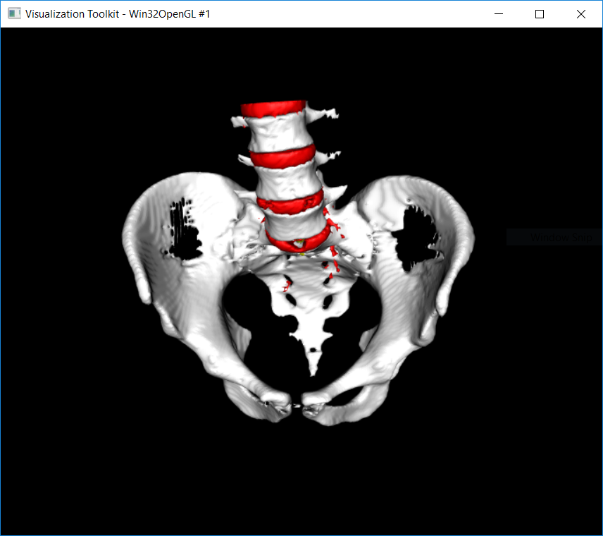

Surgical Planning
=================

In the first part you will implement a segmentation algorithm to segment the pelvis, lumbar vertebrae, intervertebral discs and the spinal cord.
In the second part you'll use an AI based algorithm to segment the liver and then calculate the volume.

Theory
-------

Programming assignment with region growing
------------------------------------------

In this assignment you have to implement a region growing algorithm, as discussed in the lecture, in the file ``assignments/planning/segmentation.py``.
Before you implement the code,e you have to unzip the data. Therefore unzip ``data/planning/Pelvis_CT.zip`` into ``data/planning/Pelvis_DT.nii``.
You are already provided with a rough implementation of the algorithm. You mainly have to complete the places with a TODO tag.

.. code-block:: python
    :linenos:

    def region_grow(image, seed_point):
        """
        Performs a region growing on the image from seed_point
        :param image: An 3D grayscale input image
        :param seed_point: The seed point for the algorithm
        :return: A 3D binary segmentation mask with the same dimensions as image
        """
        segmentation_mask = np.zeros(image.shape, np.bool)

        # Your code goes here. Fill the places with a TODO tag

        return segmentation_mask

To do the segmentation you can run ``python cas/planning/planning.py``, see details below. For this assignment you are
required to segment the Bone structures (pelvis, vertebraes), the intervertebral discs and the spinal cord. This will
lead to a 3D view like the one above. Also, the segmentation doesn't need to be perfect, but the structures should be
well separated.

Testing your algorithm
______________________

To test your algorithm, you can run the file ``cas/planning/planning.py`` in the IDE or you run it on the console with
``python cas/planning/planning.py``.

The scripts opens a window with a CT scan of a pelvis and spine model. You can use 'Space' to toggle the segmentation
overlay. Using the keys 0 - 4, you can change the active label:

0. None
1. Spinal Cord
2. Vertebraes
3. Pelvis
4. Discs

By clicking on the image, you start the segmentation with the location as the seed point. The segmented region (output
of your algorithm) will then be labelled with the active label.

Once you have your segmentation, you can save it using the key 's'. Then use the script show3d.py to visualize your segmentation in a 3D viewer.
``python cas/planning/show3d.py``.

Planning assignment with deep learning
--------------------------------------

In the second part of the assignment, you will use a deep learning based algorithm to segment a liver and calculate the liver volume.
Training and finetuning such an algorithm is ways beyond the scope of this course. However, it is important that you understand the difference
between AI based algorithms and traditional algorithms and how such algorithms can be used.

.. code-block:: python
    :linenos:

    def calc_volume(image, label, spacing):
        """
        Calculates the volume of an object with the label
        :param image: A 3D segmented volume
        :param label: The label for which the volume shall be computed
        :param spacing: The voxel spacing of the image
        :return: The volume of the object in mL
        """
        volume = 0

        return volume

Now you can run the segmentation and volumetry command. The segmentation command might take a while, depending
on your computer and whether you have a compatible GPU. The segmentation is stored in the file segmented.npy,
so you only have to run it once.

.. code-block:: bash
    :linenos:

    python cas\planning\dl\segment_liver.py --dataset-path=data\lits\ --case-id=0

This script will report you the accuracy of the segmantation in terms of the DICE coefficient. However, in
real-life you don't know how well your algorithm worked until you evaluate the results yourself.

Next you can run your volumetry program, which takes the image as input and outputs the volume of the liver
and the tumors in milliliters.

.. code-block:: bash
    :linenos:

    python assignments/planning/volumetry.py --dataset-path=data\lits\ --case-id=0

If you're interested in the details of deep learning and AI we highly recommend taking one of these courses
*. Machine learning
*. Computer Vision
*. Advanced topics in machine learning

Report
------
Write a short report (max 1 page) where you address the following questions:

#. On your segmentation mask two vertebraes are connected by 1 voxel. Which morphological operator could you use to separate these two regions?
#. Your CT image has salt & pepper noise. How would you preprocess the image to improve your segmentation?
#. You want to plan a trajectory for a pedicle screw placement on your 3D model. What information do you need to define this trajectory?
#. Which algorithm can you use to get a surface model from your segmentation?

Submission
----------
Upload a ZIP file with the following files to ILIAS:

#. Your report as PDF with filename [firstname lastname]_assignment1_report.pdf
#. Your code with filename [firstname lastname]_assignment1_code.py
#. A textfile with the console output when you ran the code with filename [firstname lastname]_assignment1_output.txt
#. A file with a screenshot of the 3D rendering of your segmentation with filename [firstname lastname]_assignment1_screenshot.png

Name your ZIP file as ``firstname_lastname_assignment1.zip``

Grading
-------

The assignment accounts for 33% of the grade for the assignments.

You can get 10 Points in this assignment:

* Working code and a correct result gives you 5 pts
   * Important: We don't grade the code quality, but it would be nice if we don't have to spend hours to understand it
* If the code does not work, but you gave it at least a decent try you get 2.5 pts
* For each correctly answered question you get 1 pt

Materials
---------
* https://docs.scipy.org/doc/scipy/reference/ndimage.html
