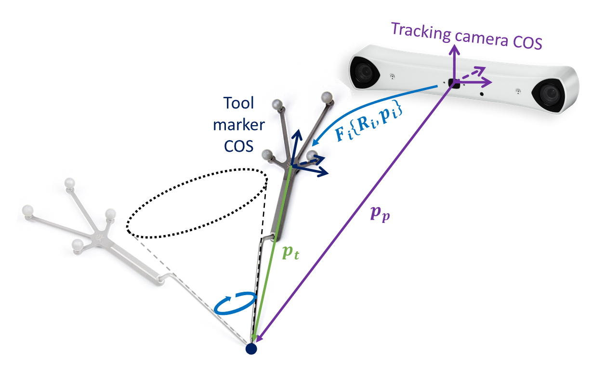
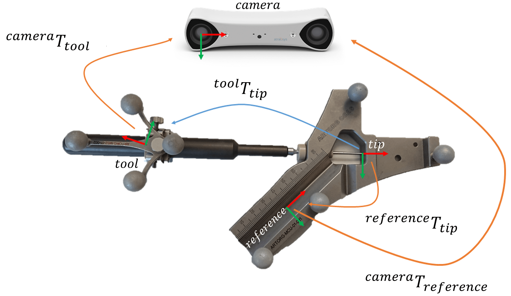

Tool Calibration
################

For a CAS scene, the location of the tool tip must be known in the coordinate system of the tracking camera. Tool calibration is performed to determine the location of the tool tip relative to its tracked location. In this assignment you will implement two different ways to calibrate a rigid straight tool.

Pivot calibration
*****************

Implement the pivot calibration algorithm as discussed in the "Positional Tracking" lecture. While pivoted around its tip, the optically tracked pose of the instrument has been saved. The data can be used to solve for the location of the tool tip relative to the origin of the tracked marker. 

Theory
======



* :math:`p_t` is constant if looking from the tool local coordinate system (COS)
* Pivot point (tool tip) :math:`p_p` is constant if looking from the tracking camera COS
* At any moment, :math:`F_i(R_i, p_i)` can be retrieved from the tracking camera API
* :math:`F_i(R_i, p_i)` takes :math:`p_t` to :math:`p_p`
* :math:`R_i \cdot p_t + p_i = p_p`
* Unknowns: :math:`p_t` and :math:`p_p`

To solve for :math:`p_t` and :math:`p_p` we need to construct a linear equation system of the form :math:`Ax = b`:

* :math:`R_i \cdot p_t - p_p = -p_i`
* and in matrix form

.. math::

    \begin{bmatrix}
    R_1 & -I \\
    R_2 & -I \\
    \vdots & \vdots \\
    R_n & -I
    \end{bmatrix}
    \begin{bmatrix}
    p_t \\
    p_p
    \end{bmatrix}
    =
    \begin{bmatrix}
    -p_1 \\
    -p_2 \\
    \vdots \\
    -p_n
    \end{bmatrix}

* which can be solved using a least squares method such as SVD.

Programming assignment
======================

Implement the pivot calibration algorithm, based on a list of saved tracked tool poses during pivoting (4x4 transformation matrices) in the file ``assignments/toolcalibration/calibration.py``. You can test your implementation by running
the file directly in PyCharm or from the console using ```python cas/toolcalibration/pivotcalibration.py``.

.. code:: python
   :number-lines:

    def pivot_calibration(transforms):
        """
        Pivot calibration

        Keyword arguments:
        transforms -- A list of 4x4 transformation matrices from the tracking system (Fi)
                      representing the tracked tool's position and orientation at
                      different instances.

        Returns:
        T          -- The calibration matrix T (in homogeneous coordinates) that defines
                      the offset (p_t) from the tracked part to the pivot point (tool tip).
        """

        ## TODO: Implement pivot calibration as discussed in the lecture

        T = np.eye(4)

        return T

Calibration device
******************

Implement the code to calibrate an instrument using a calibration device.

Theory
======



The following transformations are given:

* :math:`^{camera}T_{tool}` : transformation from the tool to the camera (given by the tracking system)
* :math:`^{camera}T_{reference}` : transformation from the reference to the camera (given by the tracking system)
* :math:`^{reference}T_{tip}` : transformation from the tip point to the reference (given by the CAD model)

The following transformation is missing:

* :math:`^{tool}T_{tip}` : calibration transformation from the tool tip to the tracked marker

To implement these calculations you can use the following definition:

.. math::

    I = ^{camera}T_{tool} \cdot ^{tool}T_{tip} \cdot ^{tip}T_{reference} \cdot ^{reference}T_{camera}

Thus, if you multiply all transformations in the same direction you get an identity.

Note: If you use the * operator Python will perform a element-wise matrix multiplication!

Programming assignment
======================
You have to implement this algorithm in the file ``assignments/toolcalibration/calibration.py``. You can test your implementation by running
the file directly in PyCharm or from the console using ```python cas\toolcalibration\calibrationdevice.py``.

.. code:: python
   :number-lines:

    def calibration_device_calibration(camera_T_reference, camera_T_tool, reference_T_tip):
        """
        Tool calibration using calibration device

        Keyword arguments:
        camera_T_reference -- Transformation matrix from reference (calibration device) to camera.
        camera_T_tool      -- Transformation matrix from tool to camera.
        reference_T_tip    -- Transformation matrix from tip to reference (calibration device).

        Returns:
        T                  -- Calibration matrix from tool to tip.
        """

        ## TODO: Implement a calibration method which uses a calibration device

        T = np.eye(4)

        return T


Code Submission
***************

Submit a ZIP file named ``lastname_firstname_assignment2.zip`` on ILIAS containing:

#. The modified ``calibration.py`` as ``lastname_firstname_assignment2_code.py``.
#. Console output in a text file named ``lastname_firstname_assignment2_output.txt``.


Online Questions
****************

Complete the "Assignment 2 - Questions" on ILIAS:

- Answer all questions.
- Each question has only one correct answer.
- All questions are equally weighted. Incorrect answers will not result in point deductions.
- You are allowed only one attempt to complete the test.


Assignment Evaluation
*********************

This assignment constitutes 25% of your total assignment grade, split equally between:

- **Code Evaluation (50%)**: points are awarded as follows:

   - **4 points** for a working solution.
   - **3 points** for only small errors.
   - **2 points** for a substantial effort.
   - **1 point** for substantial errors or minimal effort.
   - **0 points** for no attempt or plagiarism.

- **Online questions (50%)**


Resources
*********

- https://docs.scipy.org/doc/numpy/reference/routines.linalg.html#solving-equations-and-inverting-matrices
- https://docs.python.org/3/whatsnew/3.5.html#whatsnew-pep-465
- https://docs.scipy.org/doc/numpy/reference/generated/numpy.matmul.html
