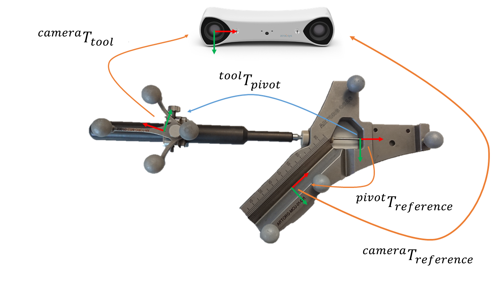

Tool Calibration
################

For a CAS scene, the location of the tool tip must be known in the coordinate system of the tracking camera. Tool calibration is perfromed to determine the location of the tool tip relative to its tracked location. In this assignment you will implement two different ways to calibrate a rigid straight tool.

Pivot calibration
*****************

Implement the pivot calibration algorithm as discussed in the "Positional Tracking" lecture. While pivoted around its tip, the optically tracked pose of the instrument has been saved. The data can be used to solve for the location of the tool tip relative to the origin of the tracked marker. 

Theory
======

.. image:: img/pivot_calibration.png

* :math:`p_t` is constant if looking from tool local Coordinate system (COS)
* Pivot point (tool tip) :math:`p_p` is constant if looking from the tracking COS
* At any moment, :math:`F_i(R_i, p_i)` can be retrieved from the tracker API
* :math:`F_i(R_i, p_i)` takes :math:`p_t` to :math:`p_p`
* :math:`R_i \cdot p_t + p_i = p_p`
* Unknowns: :math:`p_t` and :math:`p_p`

To solve for :math:`p_t` and :math:`p_p` we need to construct a linear equation system of the form :math:`Ax = b`:

* :math:`R_i \cdot p_t - p_p = -p_i`
* and in matrix form

.. math::

    \begin{bmatrix}
    R_1 & -I \\
    R_2 & -I \\
    \vdots & \vdots \\
    R_n & -I
    \end{bmatrix}
    \begin{bmatrix}
    p_t \\
    p_p
    \end{bmatrix}
    =
    \begin{bmatrix}
    -p_1 \\
    -p_2 \\
    \vdots \\
    -p_n
    \end{bmatrix}

* which can be solved using a least squares method such as SVD.

Programming assignment
======================

Implement the pivot calibration algorithm, based on a list of saved tracked tool poses duirng pivoting (4x4 transformation matrices) in the file ``assignments/toolcalibration/calibration.py``. You can test your implementation by running
the file directly in PyCharm or from the console using ```python cas/toolcalibration/pivotcalibration.py``.

.. code:: python
   :number-lines:

    def pivot_calibration(transforms):
        """ Pivot calibration
        Keyword arguments:
        transforms -- A list of 4x4 transformation matrices from the tracking system (Fi)
        returns    -- The calibration matrix T (p_t in homogeneous coordinate form),
                      where the vector p_t, is the offset from any transform, Fi, to the pivot point
        """

        ## TODO: Implement pivot calibration as discussed in the lecture

        T = np.eye(4)

        return T

Calibration device
******************

Implement the code to calibrate an instrument using a calibration device.

Theory
======



The following transformations are given:

* :math:`^{camera}T_{tool}` : transformation from the tool to the camera (given by the tracking system)
* :math:`^{camera}T_{reference}` : transformation from the reference to the camera (given by the tracking system)
* :math:`^{reference}T_{pivot}` : transformation from the pivot point to the reference (given by the CAD model)

The following transformation is missing:

* :math:`^{tool}T_{pivot}` : calibration transformation from the pivot point (tool tip) to the tool

To implement these calculations you can use the following definition:

.. math::

    I = ^{camera}T_{tool} \cdot ^{tool}T_{pivot} \cdot ^{pivot}T_{reference} \cdot ^{reference}T_{camera}

Thus, if you multiply all transformations in the same direction you get an identity.

Note: If you use the * operator Python will perform a element-wise matrix multiplication!

Programming assignment
======================
You have to implement this algorithm in the file ``assignments/toolcalibration/calibration.py``. You can test your implementation by running
the file directly in PyCharm or from the console using ```python cas\toolcalibration\calibrationdevice.py``.

.. code:: python
   :number-lines:

    def calibration_device_calibration(camera_T_reference, camera_T_tool, reference_P_pivot):
        """ Tool calibration using calibration device
        Keyword arguments:
        camera_T_reference -- Transformation from the reference (calibration device) to the camera
        camera_T_tool      -- Transformation from the tool to the camera
        reference_P_pivot  -- A pivot point on the calibration device reference (rigid body),
                              where the tip of the instrument is located for calibration
        returns            -- The tool tip location (p_t or reference_P_pivot) and the
                              calibration matrix (T), i.e. the tool tip location
                              (reference_P_pivot) relative to the tracked tool (camera_T_tool)
        """

        ## TODO: Implement a calibration method which uses a calibration device

        p_t = np.zeros((3, 1))
        T = np.eye(4)

        return p_t, T

Questions
*********

Write a short document (max 1 page) where you address the following questions:

#. Show how SVD can be used to solve your overdetermined equation of the form :math:`Ax = b` 
#. Write down the equation expressing the tip of the pointer in the camera coordinate system
#. Where does the error in your result come from (what you get is not the exact solution which is provided)?
#. How many degrees of freedeom can you calibrate with pivoting? Which ones are missing?
#. If your instrument is non-rigid (e.g. a needle) your :math:`p_t` will expereince error when the tool bends. How can you overcome this issue?

Submission
**********
Send a ZIP file with the follwing files:

#. Your document as PDF with filename ``lastname_firstname_assignment3_report.pdf``
#. Your code with filename ``lastname_firstname_assignment3_code.py``
#. A text file with the console output when you ran the code with filename ``lastname_firstname_assignment3_output.txt``

Name your ZIP file as ``lastname_firstname_assignment3.zip``

Grading
*******

The assignment accounts for 25% of the grade for the assignments.

You can get 10 Points in this assignment:


- Working code and a correct result gives you 5 pts

  * Important: We don't grade the code quality, but it would be nice if we don't have to spend hours to understand it
- If the code does not work, but you gave it at least a decent try you get 2.5 pts
- For each correctly answered question you get 1 pt


Materials
*********

- https://docs.scipy.org/doc/numpy/reference/routines.linalg.html#solving-equations-and-inverting-matrices
- https://docs.python.org/3/whatsnew/3.5.html#whatsnew-pep-465
- https://docs.scipy.org/doc/numpy/reference/generated/numpy.matmul.html
