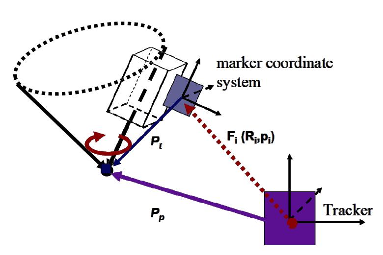

Tool Calibration
================

Implement the pivot calibration algorithm as discussed in Lecture 4.

Theory
-------



* :math:`p_t` is constant if looking from tool local COS
* Pivot point (tool tip) :math:`p_p` is constant if looking from the tracking COS
* At any moment, :math:`F_i(R_i, p_i)` can be retrieved from tracker API
* :math:`F_i(R_i, p_i)` takes :math:`p_t` to :math:`p_p`
* :math:`R_i*p_t+p_i=p_p`
* Unknowns: :math:`p_t` and :math:`p_p`

Programming assignment
----------------------

You have to implement this algorithm in the file ``assignments/toolcalibration/calibration.py``. You can test your implementation by running
the file directly in PyCharm or from the console using ```python cas/toolcalibration/pivotcalibration.py``.

.. code-block:: python
    :linenos:

    def pivot_calibration(recorded_points):
        """ pivot calibration
        Keyword arguments:
        recorded_points --  ...
        returns -- transformation T, residual error
        """
        p_t = np.zeros((3, 1))
        T = np.eye(4)

        # your code goes here

        return p_t, T


Report
------

Write a short report (max 1 page) where you address the following questions:

#. In which coordinate system is the vector :math:`p_t`
#. Write down the formula to get the tip of the pointer in the camera coordinate system
#. Where does the error in your result come from (what you get is not the exact solution which is provided)?
#. How many degrees of freedeom can you calibrate with pivoting? Which ones are missing?
#. If your instrument is non-rigid (e.g. a needle) your :math:`p_t` is off if your instrument is bent. How can you overcome this issue?

Submission
----------
Send a ZIP file with the follwing files:

#. Your report as PDF with filename [firstname lastname]_assignment2_report.pdf
#. Your code with filename [firstname lastname]_assignment2_code.py
#. A textfile with the console output when you ran the code with filename [firstname lastname]_assignment2_output.txt

Name your ZIP file as ``firstname_lastname_assignment2.zip``

Grading
-------

The assignment accounts for 33% of the grade for the assignments.

You can get 10 Points in this assignment:

* Working code and a correct result gives you 5 pts
   * Important: We don't grade the code quality, but it would be nice if we don't have to spend hours to understand it
* If the code does not work, but you gave it at least a decent try you get 2.5 pts
* For each correctly answered question you get 1 pt

Materials
----------

* https://docs.scipy.org/doc/numpy/reference/routines.linalg.html#solving-equations-and-inverting-matrices
