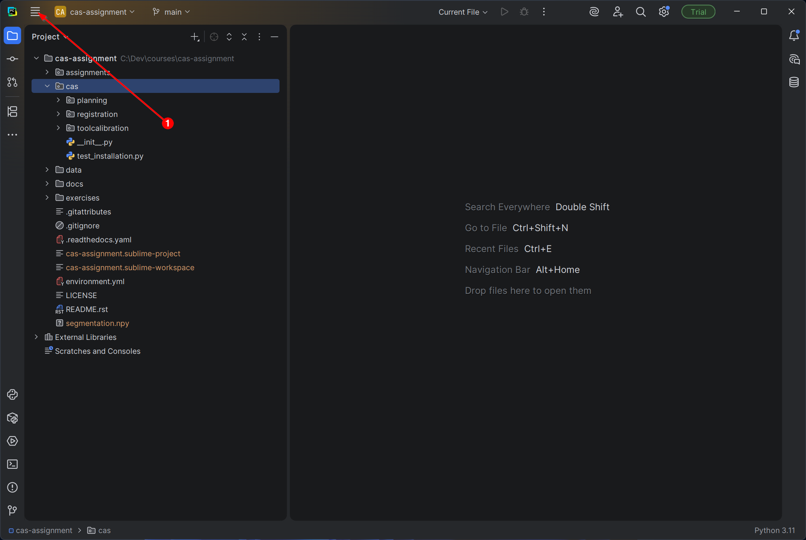
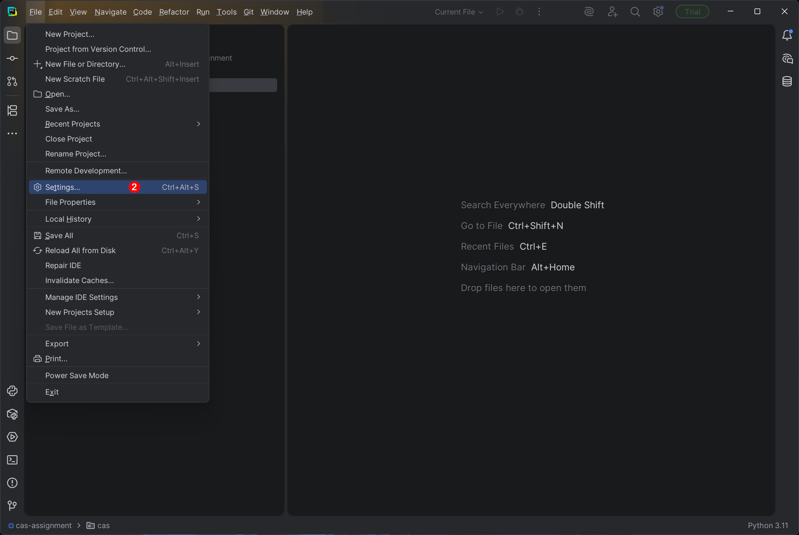
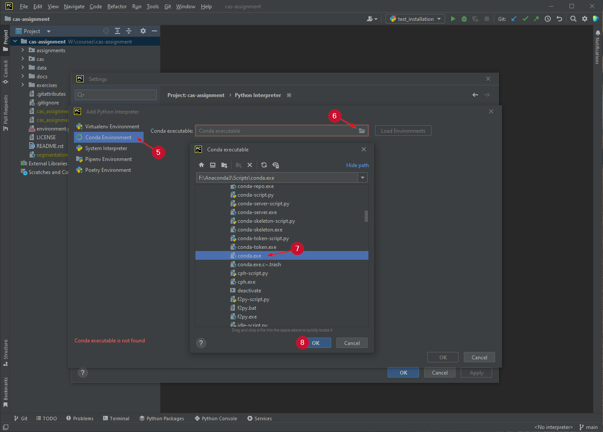
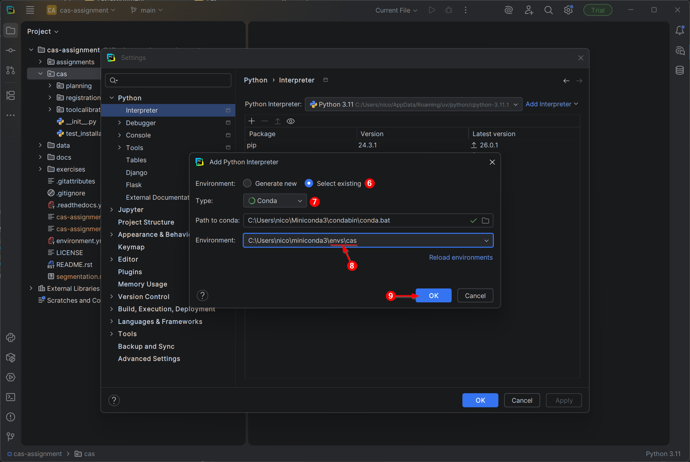
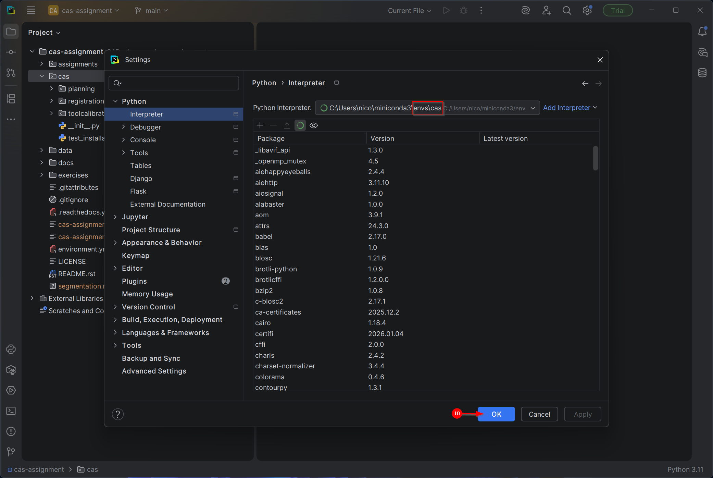

Integrated Development Environment
==================================

We recommend to use `JetBrains PyCharm <https://www.jetbrains.com/pycharm/>`_ as Integrated Development Environment (IDE) to program in Python.
The community edition is open-source and sufficient for our purposes.
Follow the official `instructions <https://www.jetbrains.com/help/pycharm/requirements-installation-and-launching.html>`_ to install PyCharm.

To open the CAS Assignment as a project and to configure the Python interpreter do the following:

#. Launch PyCharm
#. Click *Open* (or *File > Open*)

    #. In the dialog navigate to ``</path/to/where/you/have/the/code>/cas-assignment``
    #. Click OK

#. Click *File > Settings...* to open the settings dialog

    #. Navigate to *Project: CAS Assignment > Python Interpreter*
    #. Select the Python interpreter

        - on Windows: ``<\path\to\your\anaconda\installation>\envs\cas\python.exe``
        - on Linux or macOS: ``</path/to/your/anaconda/installation>/envs/cas/bin/python``
        - If the interpreter is not available in the combo box

            - click the gear icon and choose *Add...*
            - select the *Conda Environment > Existing environment*
            - the interpreter path should match the path above

    #. Confirm by clicking OK

#. CAS Assignment is now open as PyCharm project (PyCharm created the ``.idea`` directory)

#. Open the ``test_installation.py`` from the ``cas`` directory in the navigator

    #. In the editor, *right click > Modify Run Configuration*
    #. In the dialog, change the *Working directory:* to ``</path/to/where/you/have/the/code>/cas-assignment`` (remove the ``/cas``)
    #. Confirm by clicking OK
    #. PyCharm will add a ``test_installation`` configuration (see top right corner) to the project
    #. Now you can run the file by clicking on the *play* button, or by *right click > Run 'test_installation'*
    #. Note that you can add configurations manually under *Run > Edit Configurations...*

#. For each assignment, make sure your *working directory* is set to ``</path/to/where/you/have/the/code>/cas-assignment``

You can watch the `getting started <https://www.jetbrains.com/pycharm/documentation/>`_ videos to get accustomed with the interface.

A picture is worth a thousand words
-----------------------------------

|

|

|

|

|
